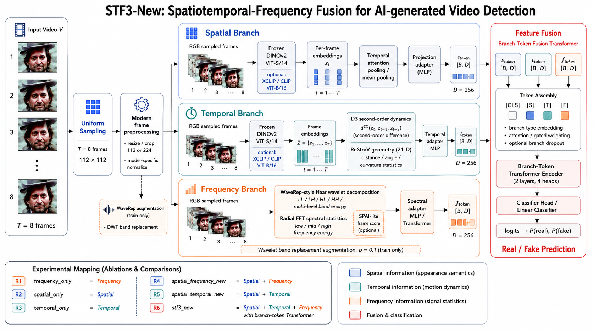

# STF3-New：基于空间—时序—频域三分支融合的 AI 生成视频检测系统

> Content Security Final Project  
> 当前主模型：`STF3-New R7_224_FAKEW12`  
> 当前最佳单模型权重：`runs/ood_stf3_new_224_fakew12/best.pt`  
> 最终主指标协议：OOD test + validation-calibrated `precision_0.95_recall_max`  
> 外部泛化诊断：AEGIS hard test set（ACM MM 2025）

本项目面向 **AI-generated video detection**：输入一段视频，输出其属于 `real` 或 `fake / AI-generated` 的概率。项目最初从轻量三分支 STF3-Lite 出发，随后重构为 **STF3-New**：用现代视觉 foundation encoder、D3/ReStraV 风格时序线索、WaveRep/SPAI 风格频域线索，以及 branch-token Transformer 融合，构建一个可训练、可解释、适合课程硬件复现的 AI 视频检测系统。

项目当前不是只追求 Random split 上的高分，而是以 **跨生成器 OOD 泛化** 作为主要评价目标：模型在训练阶段不见到 `MorphStudio / Show_1 / Sora / WildScrape` 等测试生成器，最终检测这些未见生成器生成的视频。后续又加入 **AEGIS hard test set** 作为外部数据集诊断，用于检验模型是否能泛化到新的真实视频来源和新的 AI 视频生成器。

---

## 1. 项目核心结论

### 1.1 最终推荐汇报结果

当前推荐作为项目主结果的 STF3 单模型是：

```text
R7_224_FAKEW12
= stf3_new
+ image_size=224
+ num_frames=8
+ fake_loss_weight=1.2
+ validation-calibrated threshold=0.0545
```

在 OOD test 上，采用 `precision_0.95_recall_max` 阈值策略后：

| Model | Test N | Threshold | ACC | AUC | F1 | Precision | Recall | FN | FP |
|---|---:|---:|---:|---:|---:|---:|---:|---:|---:|
| `STF3-New R7_224_FAKEW12` | 3,598 | 0.0545 | **0.9430** | 0.9848 | **0.9499** | 0.9740 | **0.9271** | **153** | 52 |

该结果代表 **STF3 主模型本体**，不包含 branch-level Logistic Regression calibration、STF3-only ensemble 或外部模型融合。

### 1.2 最重要的公平消融

为了证明频域分支和三分支融合不是“装饰性模块”，项目最终采用同等条件下的 R5/R7 对照：

| Model | Branches | image_size | fake_loss_weight | Threshold objective | ACC | F1 | Precision | Recall | FN | FP |
|---|---|---:|---:|---|---:|---:|---:|---:|---:|---:|
| `R5_224_FAKEW12` | Spatial + Temporal | 224 | 1.2 | `precision_0.95_recall_max` | 0.9277 | 0.9360 | 0.9679 | 0.9061 | 197 | 63 |
| `R7_224_FAKEW12` | Spatial + Temporal + Frequency | 224 | 1.2 | `precision_0.95_recall_max` | **0.9430** | **0.9499** | **0.9740** | **0.9271** | **153** | **52** |

在相同分辨率、相同类别损失权重、相同验证集阈值策略下，R7 相比 R5：

- FN 从 197 降到 153，减少 44 个 fake 漏检；
- FP 从 63 降到 52，误报也更少；
- F1、ACC、Precision、Recall 均提升。

因此，本项目的主要方法结论是：**三分支 STF3-New 在 OOD 决策层面比双分支 S+T baseline 更均衡，尤其更有利于降低 AI 视频漏检。**

---

## 2. 方法概览



STF3-New 的输入是均匀采样后的视频帧：

```text
frames: [B, T, 3, H, W]
```

模型由三类互补证据组成：

| Branch | 代码位置 | 设计来源 | 作用 |
|---|---|---|---|
| Spatial | `src/models/branches/spatial_foundation_branch.py` | ReStraV / D3 中使用的 DINOv2、CLIP、XCLIP foundation representation | 捕捉单帧纹理、物体结构、生成痕迹和跨帧空间语义稳定性 |
| Temporal | `src/models/branches/temporal_modern_branch.py` | D3 second-order dynamics + ReStraV representation trajectory geometry | 捕捉帧间动态退化、embedding 轨迹转角、曲率和步长异常 |
| Frequency | `src/models/branches/frequency_wavelet_branch.py` | WaveRep wavelet band cue + SPAI-style radial spectral statistics | 捕捉小波子带能量、径向频谱统计和生成视频频域异常 |
| Fusion | `src/models/fusion/branch_token_transformer.py` | branch-token Transformer / gated fusion | 将 S/T/F 三个 token 做样本级自适应融合，输出 real/fake logits |

核心实现入口：

```text
src/models/stf3_modern.py
src/models/model_factory.py
```

`STF3Modern` 中的现代模型模式包括：

```text
spatial_dino
temporal_d3
temporal_restrav
temporal_d3_restrav
frequency_wave
spatial_frequency_new
spatial_temporal_new
stf3_new
stf3_new_concat
```

> 注意：`spatial / frequency / temporal / stf3` 等是早期 legacy 模型；正式实验与答辩主线应优先使用 `*_new` 和 `stf3_new`。

### 2.1 模型是否需要训练？

STF3-New 是 **可训练模型**，不是 training-free 方法。

更准确地说：

- DINOv2 / CLIP / XCLIP 等 foundation encoder 默认 **冻结**；
- Spatial / Temporal / Frequency adapter、auxiliary heads、fusion Transformer、classification head 需要在本项目数据上训练；
- 默认使用 cross entropy，可通过 `--fake-loss-weight` 提高 fake 类损失；
- 默认按 validation AUC 保存 `best.pt`；
- 最终报告时，再用 validation set 选择阈值并固定到 OOD test。

对应训练参数在 `src/train.py` 中定义，关键参数包括：

```text
--foundation-backbone dinov2_vits14
--finetune-foundation          # 默认不打开；打开后才微调 foundation encoder
--wavelet-aug-prob 0.1
--wavelet-aug-mode batch|bank
--branch-dropout 0.1
--aux-loss-weight 0.2
--fake-loss-weight 1.2
```

### 2.2 预测流程

推理时，模型输出二分类 logits：

```text
logits = model(frames)
prob_fake = softmax(logits)[fake]
prediction = 1 if prob_fake >= threshold else 0
```

本项目最终不用固定默认阈值 0.5，而是采用验证集阈值校准：

```text
precision_0.95_recall_max:
在 validation set 上筛选 Precision >= 0.95 的所有阈值，
从中选择 Recall 最高的阈值，
然后把该阈值固定应用到 OOD test。
```

这样做的原因是：AI 视频检测属于内容安全任务，既要控制误报，也要尽可能减少 fake 漏检。因此主表统一采用验证集确定 operating point，避免在 test set 上为不同模型挑选最好看的阈值。

---

## 3. 项目结构

```text
final_project/
├── data/GenVideo-Val/                 # 数据集与 split CSV，不提交 Git
│   └── splits/
│       ├── random_train.csv
│       ├── random_val.csv
│       ├── random_test.csv
│       ├── ood_train.csv
│       ├── ood_val.csv
│       └── ood_test.csv
├── src/
│   ├── dataset.py                     # 视频读取、采样、transform
│   ├── train.py                       # 训练入口
│   ├── evaluate.py                    # 评估入口，输出 metrics/predictions
│   ├── visualize.py                   # 混淆矩阵、ROC、训练曲线等
│   ├── features/
│   │   ├── d3.py                      # D3-style second-order dynamics
│   │   ├── geometry.py                # ReStraV-style trajectory geometry
│   │   ├── wavelet.py                 # WaveRep-style wavelet features / augmentation
│   │   └── spectral.py                # radial FFT spectral statistics
│   └── models/
│       ├── stf3_modern.py             # STF3-New 主模型
│       ├── model_factory.py           # legacy / modern 模型选择
│       ├── backbones/
│       │   └── foundation_encoder.py  # DINOv2 / CLIP / XCLIP backbone
│       ├── branches/
│       │   ├── spatial_foundation_branch.py
│       │   ├── temporal_modern_branch.py
│       │   └── frequency_wavelet_branch.py
│       └── fusion/
│           └── branch_token_transformer.py
├── scripts/
│   ├── prepare_genvideo_val.py
│   ├── ood_threshold_calibration.py
│   ├── ood_generator_error_analysis.py
│   ├── ood_branch_calibration_lr.py
│   ├── ood_multiclip_predict.py
│   └── run_stf3_new_*.ps1
├── notebooks/
│   ├── Random_Split_R1_R7_Experiments.ipynb
│   ├── OOD_Split_R1_R7_Experiments.ipynb
│   └── OOD_Followup_Optimization_Experiments.ipynb
├── comparison_experiment/             # D3 / WaveRep / TALL 等外部对比
├── docs/                              # 实验记录、方案、图表、最终说明
├── runs/                              # 训练权重与 history，不提交 Git
├── outputs/                           # 评估结果、predictions、figures，不提交 Git
├── ENVIRONMENT.md
├── requirements.txt
├── requirements-lock.txt
└── README.md
```

---

## 4. 环境配置

本项目在 Windows + PowerShell + RTX 4060 Laptop GPU 上开发和实验。

```powershell
cd "D:\VsCode Program\Python\content_security\final_project"
.\.venv\Scripts\Activate.ps1
python scripts\check_gpu.py
```

已记录环境：

```text
Python 3.12.7
PyTorch 2.11.0 + CUDA 12.8
NVIDIA GeForce RTX 4060 Laptop GPU
```

安装依赖：

```powershell
pip install -r requirements.txt
```

如果需要完全复现当前本地环境，可参考：

```text
ENVIRONMENT.md
requirements-lock.txt
```

> DINOv2 默认可能通过 `torch.hub` 加载权重；若首次运行时网络不稳定，优先检查 backbone 权重缓存，而不是误判为训练代码错误。

---

## 5. 数据划分

项目使用 `GenVideo-Val`，已建立两套实验协议。

| Split | train | val | test | 设计意义 |
|---|---:|---:|---:|---|
| Random | 12,804 | 2,743 | 2,755 | 同生成器家族随机划分，用于验证模型是否能学习有效 real/fake 判别 |
| OOD | 12,273 | 2,429 | 3,598 | 按生成器划分 train/val/test，用于跨生成器泛化测试 |

OOD 生成器划分：

| Stage | Generators |
|---|---|
| train / val | `Lavie`, `Gen2`, `HotShot`, `MoonValley`, `ModelScope`, `Crafter`, `real_MSRVTT` |
| test | `MorphStudio`, `Show_1`, `Sora`, `WildScrape`, `real_MSRVTT` |

数据准备：

```powershell
python scripts\prepare_genvideo_val.py
```

生成的 split 文件：

```text
data/GenVideo-Val/splits/random_train.csv
data/GenVideo-Val/splits/random_val.csv
data/GenVideo-Val/splits/random_test.csv
data/GenVideo-Val/splits/ood_train.csv
data/GenVideo-Val/splits/ood_val.csv
data/GenVideo-Val/splits/ood_test.csv
```

---

## 6. 快速运行

### 6.1 Smoke test

用于检查数据读取、GPU、训练循环、评估和可视化是否能跑通：

```powershell
.\.venv\Scripts\python.exe -m src.train `
  --model stf3_new `
  --train-csv data\GenVideo-Val\splits\random_train.csv `
  --val-csv data\GenVideo-Val\splits\random_val.csv `
  --epochs 1 `
  --batch-size 1 `
  --num-frames 4 `
  --image-size 112 `
  --foundation-backbone dinov2_vits14 `
  --max-train-samples 12 `
  --max-val-samples 8 `
  --amp `
  --out-dir runs\smoke_stf3_new

.\.venv\Scripts\python.exe -m src.evaluate `
  --checkpoint runs\smoke_stf3_new\best.pt `
  --csv data\GenVideo-Val\splits\random_test.csv `
  --batch-size 1 `
  --max-samples 8 `
  --amp `
  --out-dir outputs\smoke_stf3_new
```

### 6.2 复现最终主模型训练

```powershell
.\.venv\Scripts\python.exe -m src.train `
  --model stf3_new `
  --train-csv data\GenVideo-Val\splits\ood_train.csv `
  --val-csv data\GenVideo-Val\splits\ood_val.csv `
  --epochs 5 `
  --batch-size 1 `
  --num-frames 8 `
  --image-size 224 `
  --foundation-backbone dinov2_vits14 `
  --wavelet-aug-prob 0.1 `
  --branch-dropout 0.1 `
  --aux-loss-weight 0.2 `
  --fake-loss-weight 1.2 `
  --amp `
  --out-dir runs\ood_stf3_new_224_fakew12
```

### 6.3 评估最终主模型

```powershell
.\.venv\Scripts\python.exe -m src.evaluate `
  --checkpoint runs\ood_stf3_new_224_fakew12\best.pt `
  --csv data\GenVideo-Val\splits\ood_test.csv `
  --batch-size 1 `
  --amp `
  --out-dir outputs\ood_stf3_new_224_fakew12
```

默认评估会生成：

```text
outputs/<实验名>/metrics.json
outputs/<实验名>/predictions.csv
```

如果需要复现最终表格中的阈值校准结果，请使用：

```powershell
.\.venv\Scripts\python.exe scripts\ood_threshold_calibration.py `
  --project-root . `
  --out-dir outputs\ood_followup
```

---

## 7. 实验体系

本项目的实验不是一次性调参，而是按问题逐步推进：

```text
Random split 验证模型是否能学习
    ↓
OOD split 检验跨生成器泛化
    ↓
阈值校准区分“排序能力”和“决策能力”
    ↓
错误分析发现主要失败来源 WildScrape
    ↓
围绕输入分辨率、fake 类损失、推理融合、WaveRep-bank、16 帧采样继续优化
    ↓
确定当前最佳单模型 R7_224_FAKEW12
```

### 7.1 Random split 基础实验

Random split 中 train/val/test 共享生成器家族，主要用于验证训练流程和模型学习能力。当前完成的代表性结果：

| Model | Branches | ACC | AUC | F1 | Precision | Recall |
|---|---|---:|---:|---:|---:|---:|
| `frequency_wave` | F | 0.8657 | 0.9309 | 0.8440 | 0.8962 | 0.7976 |
| `spatial_temporal_new` | S+T | 0.9735 | **0.9967** | 0.9705 | **0.9836** | 0.9578 |
| `stf3_new` | S+T+F | **0.9750** | 0.9963 | **0.9722** | 0.9821 | **0.9625** |

Random 结果接近饱和，因此它适合证明“模型可以学到有效线索”，但不足以单独证明 OOD 泛化能力。

### 7.2 OOD split R1-R7 基础消融

OOD split 是项目的主实验设置。原始 R1-R7 在默认阈值 0.5 下的结果如下：

| ID | Model | Branches / Fusion | ACC | AUC | F1 | Precision | Recall | FN | FP |
|---|---|---|---:|---:|---:|---:|---:|---:|---:|
| R1 | `frequency_wave` | F | 0.8060 | 0.9354 | 0.8075 | 0.9581 | 0.6978 | 634 | 64 |
| R2 | `spatial_dino` | S | 0.8858 | 0.9657 | 0.8923 | 0.9913 | 0.8112 | 396 | 15 |
| R3 | `temporal_d3_restrav` | T | 0.8130 | 0.9550 | 0.8134 | 0.9722 | 0.6992 | 631 | 42 |
| R4 | `spatial_frequency_new` | S+F / Transformer | 0.8749 | 0.9636 | 0.8805 | 0.9940 | 0.7903 | 440 | 10 |
| R5 | `spatial_temporal_new` | S+T / Transformer | 0.8877 | **0.9795** | 0.8939 | **0.9959** | 0.8108 | 397 | 7 |
| R6 | `stf3_new_concat` | S+T+F / Gated Concat | 0.8819 | 0.9744 | 0.8879 | 0.9941 | 0.8022 | 415 | 10 |
| R7 | `stf3_new` | S+T+F / Branch-token Transformer | **0.9161** | 0.9651 | **0.9235** | 0.9854 | **0.8689** | **275** | 27 |

这里可以看到：R5 的 AUC 和 Precision 很高，但 R7 明显降低 FN、提高 Recall/F1/ACC。这也是后续选择 R7 作为主线继续优化的原因。

### 7.3 OOD 后续优化与负结果

后续优化重点解决的问题是：默认阈值下模型 Precision 高、Recall 相对不足，fake 漏检主要集中在 `WildScrape`。因此实验逐步尝试：

- 验证集阈值校准；
- 延长 epoch；
- 输入分辨率从 112 提升到 224；
- fake 类 loss weight 从 1.0 提升到 1.2；
- R5/R7 概率融合；
- branch-level LR calibration；
- multi-clip 推理；
- donor-bank 版本 WaveRep 增强；
- 完整视频 16 帧采样。

最终结论：

| Method | ACC | F1 | Precision | Recall | FN | FP | 结论 |
|---|---:|---:|---:|---:|---:|---:|---|
| `R7_224_FAKEW12` | **0.9430** | **0.9499** | 0.9740 | **0.9271** | **153** | 52 | 当前最佳 STF3 单模型 |
| STF3-only ensemble | 0.9439 | 0.9508 | 0.9731 | 0.9295 | 148 | 54 | 略升，但属于推理融合，不作为主模型 |
| Branch-level LR calibration | 0.9466 | 0.9530 | 0.9794 | 0.9280 | 151 | 41 | 后处理效果好，但不代表端到端主模型 |
| WaveRep-bank | 0.9283 | 0.9351 | **0.9894** | 0.8866 | 238 | **20** | 更保守，降低 FP 但增加 FN |
| 16-frame | 0.9339 | 0.9408 | 0.9834 | 0.9018 | 206 | 32 | 未超过 8 帧主模型 |

重要实现复核：早期 `wavelet_aug_prob=0.1` 在 `batch_size=1` 且 `wavelet_aug_mode=batch` 时，因为缺少 batch 内 donor，实际不会发生有效 WaveRep band replacement。后续 `wavelet_aug_mode=bank` 使增强真正生效，但实验结果未超过 `R7_224_FAKEW12`。因此最终文档中不把主模型提升归因于 WaveRep 训练增强，而是归因于 wavelet/spectral frequency branch、224 输入分辨率、fake loss weight 和验证集阈值校准的组合。

---

## 8. 外部对比实验

外部对比统一使用 GenVideo-Val OOD 协议，并在 validation set 上选择阈值。主表统一保留 `precision_0.95_recall_max` operating point。

| Type | Method | Test N | AUC | F1 | Precision | Recall | FN | FP | 说明 |
|---|---|---:|---:|---:|---:|---:|---:|---:|---|
| Proposed | `STF3-New R7_224_FAKEW12` | 3,598 | 0.9848 | **0.9499** | 0.9740 | **0.9271** | **153** | 52 | 三分支可解释融合主模型 |
| External training-free | `D3 XCLIP-16 L2` | 3,585 | 0.9513 | 0.7662 | 0.9806 | 0.6288 | 774 | 26 | 二阶动态退化线索，阈值化后较保守 |
| External pretrained | `WaveRep DINOv2 G4` | 3,585 | 0.9573 | 0.9207 | 0.9758 | 0.8715 | 268 | 45 | 官方预训练取证检测器 |
| External trainable | `TALL-SWIN 3ep best.pt` | 3,585 | **0.9898** | 0.9296 | **0.9929** | 0.8739 | 253 | **23** | 强 Swin thumbnail-layout baseline |

严谨表述：

- STF3-New 相比 D3 和 WaveRep 有更高 F1/Recall，并显著减少 fake 漏检；
- TALL 在 AUC、Precision 和 FP 控制上更强，说明强 Swin backbone 与 thumbnail-layout 时空建模非常有效；
- STF3-New 的优势是结构更轻、更可解释，并在当前统一高 precision operating point 下取得更高 Recall 和更少 FN；
- 因此不应表述为“全面击败所有外部方法”，而应表述为“在可解释三分支框架下取得了与强外部 baseline 竞争的 OOD 检测性能，尤其在漏检控制上表现突出”。

外部实验记录见：

```text
docs/对比实验结果.md
comparison_experiment/
```

### 8.1 AEGIS 外部测试集实验

为了进一步检验模型是否只是在 GenVideo-Val 内部 OOD split 上有效，项目新增了 **AEGIS hard test set** 作为外部泛化诊断集。

AEGIS 论文信息：

```text
AEGIS: Authenticity Evaluation Benchmark for AI-Generated Video Sequences
ACM Multimedia 2025 / ACM MM 2025
```

相关链接：

| 类型 | 链接 |
|---|---|
| ACM Digital Library | https://dl.acm.org/doi/10.1145/3746027.3758295 |
| arXiv | https://arxiv.org/abs/2508.10771 |
| Hugging Face Dataset | https://huggingface.co/datasets/Clarifiedfish/AEGIS |

本项目使用 AEGIS hard test set：

```text
data/AEGIS/splits/aegis_hard_test.csv
```

数据构成：

| 类型 | 来源 / 生成器 | 数量 |
|---|---|---:|
| Fake | Kling | 111 |
| Fake | Sora | 107 |
| Real | DVF | 109 |
| Real | YouTube | 109 |
| Total | - | 436 |

需要强调的是：**AEGIS 不参与 STF3 或外部 baseline 的训练过程**，只作为外部测试集/诊断集。

AEGIS 主对比结果如下：

| 模型 | ACC | AUC | F1 | Precision | Recall | TN | FP | FN | TP |
|---|---:|---:|---:|---:|---:|---:|---:|---:|---:|
| `STF3-New R7_224_FAKEW12` | 0.6858 | 0.7184 | 0.7523 | 0.6209 | **0.9541** | 91 | 127 | 10 | 208 |
| `TALL-SWIN` | **0.8165** | **0.8846** | **0.8238** | **0.7924** | 0.8578 | 169 | 49 | 31 | 187 |
| `WaveRep DINOv2 G4` | 0.7615 | 0.8452 | 0.7570 | 0.7714 | 0.7431 | **170** | **48** | 56 | 162 |
| `D3 XCLIP-16 L2` | 0.6216 | 0.6630 | 0.7208 | 0.5710 | **0.9771** | 58 | 160 | **5** | **213** |

严谨解释：

- STF3 在 AEGIS 上具有很强的 AI 视频检出能力，Recall=0.9541，218 个 AI 视频中检出 208 个；
- 但 STF3 的真实视频误报较多，FP=127，Precision=0.6209；
- 这说明 STF3 在外部 hard set 上更像高召回初筛模型，而不是低误报最终判定器；
- TALL 在 AEGIS 上整体二分类指标更均衡；
- WaveRep 更偏保守，高精度工作点可以进一步降低 FP，但会牺牲 Recall；
- D3 作为 training-free baseline 也呈现高召回但高误报的特征。

因此，AEGIS 实验不能被表述为“STF3 在外部数据集上整体表现优异”。更准确的结论是：

> STF3 对 AI 生成视频具有较强敏感性，但跨数据集真实视频分布偏移会导致较多误报。后续优化应重点关注真实视频 hard negatives、阈值迁移校准和跨数据集 domain shift 适应。

完整记录见：

```text
docs/AEGIS数据集测试汇总.md
```

### 8.2 RealRobust-UCF101 真实视频增强实验：负结果

针对 AEGIS 上 STF3 真实视频误报较多的问题，进一步尝试了 RealRobust-UCF101 实验：

```text
Train = GenVideo OOD train + 2000 个 UCF-101 real videos
Val   = GenVideo OOD val
Test  = AEGIS hard test set
```

实验目的不是提升 Recall，而是希望通过加入额外真实视频降低 AEGIS 上的 FP，提高 Precision / Specificity。

AEGIS 测试结果如下：

| 模型 | ACC | AUC | F1 | Precision | Recall | Specificity | TN | FP | FN | TP |
|---|---:|---:|---:|---:|---:|---:|---:|---:|---:|---:|
| Original STF3-New R7_224_FAKEW12 | 0.6858 | 0.7184 | 0.7523 | 0.6209 | 0.9541 | 0.4174 | 91 | 127 | 10 | 208 |
| RealRobust-UCF101 | 0.6514 | 0.7095 | 0.7185 | 0.6025 | 0.8899 | 0.4128 | 90 | 128 | 24 | 194 |

结论：

- FP 从 127 增加到 128，真实视频误报没有降低；
- FN 从 10 增加到 24，AI 视频漏检反而增加；
- Recall 从 0.9541 降到 0.8899；
- ACC、AUC、F1、Precision 均下降；
- 因此 RealRobust-UCF101 是负结果，不替代主模型。

该结果说明：**简单加入普通真实视频并不等于有效 hard negative mining**。UCF-101 主要是动作识别数据集，其场景和压缩分布与 AEGIS 的 `real/youtube`、`real/dvf` 不完全一致，因此未能改善 AEGIS 上的真实视频误报。

完整记录见：

```text
docs/STF3_RealRobust_UCF101实验方案.md
docs/AEGIS数据集测试汇总.md
```

---

## 9. 常用脚本与 Notebook

### 9.1 Notebook 实验入口

| Notebook | 用途 |
|---|---|
| `notebooks/Random_Split_R1_R7_Experiments.ipynb` | Random split R1-R7 编排 |
| `notebooks/OOD_Split_R1_R7_Experiments.ipynb` | OOD split R1-R7 编排 |
| `notebooks/OOD_Followup_Optimization_Experiments.ipynb` | OOD 后续优化、阈值校准、错误分析、负结果 |

Notebook 只作为实验编排层，核心训练/评估仍调用：

```text
python -m src.train
python -m src.evaluate
python -m src.visualize
```

### 9.2 PowerShell 运行脚本

```text
scripts/run_stf3_new_smoke.ps1
scripts/run_stf3_new_random.ps1
scripts/run_stf3_new_random_ablation.ps1
scripts/run_stf3_new_ood.ps1
scripts/run_stf3_new_ood_ablation.ps1
```

### 9.3 分析脚本

```text
scripts/ood_threshold_calibration.py
scripts/ood_generator_error_analysis.py
scripts/ood_r5_r7_ensemble.py
scripts/ood_branch_calibration_lr.py
scripts/ood_multiclip_predict.py
scripts/analyze_failures.py
scripts/compute_model_size.py
```

---

## 10. 输出文件说明

训练输出：

```text
runs/<实验名>/best.pt
runs/<实验名>/last.pt
runs/<实验名>/history.json
```

评估输出：

```text
outputs/<实验名>/metrics.json
outputs/<实验名>/predictions.csv
```

可视化输出：

```text
outputs/figures/<实验名>/confusion_matrix.png
outputs/figures/<实验名>/roc_curve.png
outputs/figures/<实验名>/history_loss.png
outputs/figures/<实验名>/history_acc.png
outputs/figures/<实验名>/history_auc.png
outputs/figures/<实验名>/history_f1.png
outputs/figures/<实验名>/accuracy_by_generator.png
```

---

## 11. 重要文档索引

| 文档 | 内容 |
|---|---|
| `项目解释.md` | 当前项目的完整解释文档，包含方法、实验脉络、优化过程与对比实验 |
| `docs/STF3-New_方法选择与代码重构方案.md` | STF3-New 方法来源、分支设计和代码重构方案 |
| `docs/STF3-New_Random_OOD_完整实验运行方案.md` | Random / OOD R1-R7 实验运行方案 |
| `docs/Random Split 实验结果汇总.md` | Random split 结果记录 |
| `docs/OOD Split 实验结果汇总.md` | OOD R1-R7 基础实验结果 |
| `docs/OOD 后续优化研究过程与实验结果汇总.md` | OOD 后续优化过程、阈值校准、负结果和最终主模型 |
| `docs/对比实验结果.md` | D3 / WaveRep / TALL 外部对比实验 |
| `docs/AEGIS数据集测试汇总.md` | AEGIS hard test set 外部泛化实验与失败模式分析 |
| `docs/STF3_RealRobust_UCF101实验方案.md` | UCF-101 真实视频增强实验与负结果记录 |
| `docs/STF3_experiment_rigor_plan.md` | 答辩前实验严谨性检查与主张边界 |

---

## 12. 项目边界

本项目是课程 final project，不是线上内容审核系统。当前结论仅基于 `GenVideo-Val` 及本项目构造的 Random/OOD split：

- Random split 高分不等于真实部署泛化；
- OOD split 更接近跨生成器检测，但仍不是全部真实世界分布；
- AEGIS hard test set 进一步说明跨数据集泛化仍有明显 domain shift；
- WildScrape 是当前主要困难来源，仍贡献了最终模型的大部分 FN；
- STF3 在 AEGIS 上 AI 视频召回率高，但真实视频误报较多，不能表述为外部数据集整体最优；
- RealRobust-UCF101 说明“简单增加普通真实视频”不能直接解决外部真实视频误报，仍需要更接近目标域的 hard negatives；
- 后处理方法可以进一步提高数值，但主结果优先报告端到端 STF3 单模型；
- 外部 baseline 的读取失败样本数与有效 test N 已在对比文档中单独说明。

---

## 13. 一句话总结

STF3-New 将空间 foundation representation、D3/ReStraV 时序轨迹线索和 Wavelet/Spectral 频域线索组织为三分支 token，并用轻量 Transformer 做自适应融合；在 GenVideo-Val OOD 跨生成器检测中，最终单模型 `R7_224_FAKEW12` 取得 ACC 0.9430、F1 0.9499、Recall 0.9271，并将 fake 漏检降至 153 个，是当前项目最适合汇报的主模型。AEGIS 外部测试进一步表明，STF3 对 AI 视频检出很敏感，但真实视频误报偏高；RealRobust-UCF101 负结果说明，后续优化不能只靠简单增加普通 real 数据，而应转向更接近目标域的 hard negatives 和跨数据集校准。
